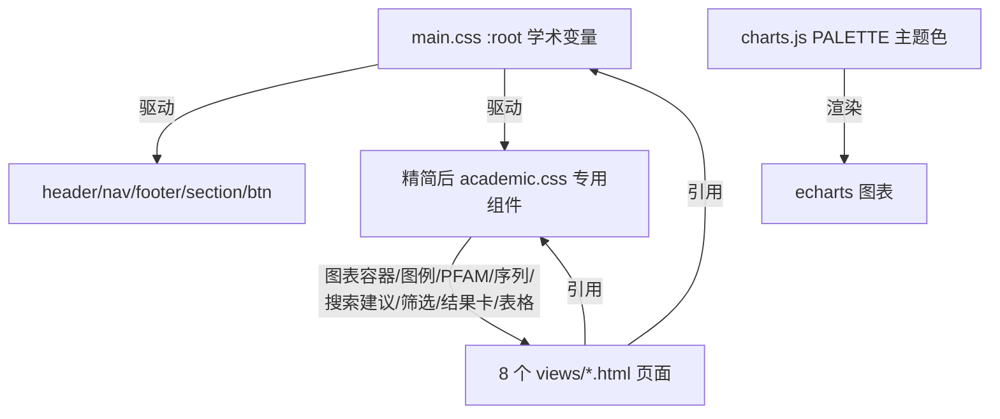

## 用户需求

当前 Cella LAB 数据库的 8 个页面（首页/搜索/搜索结果/合成菌群/宏基因组/泛基因组/通路/基因）样式混乱。根因是上一轮新建的 `academic.css` 自创了 `--cl-*` 变量体系与大量 `cl-` 组件类，与现成的 `main.css`（BootstrapMade 营销模板）并存并互相覆盖，导致配色割裂、排版不统一。

用户已确认的方向：

1. 以 `main.css` 为基底改造学术配色——保留 main.css 的组件与排版结构，将其根变量（`--accent-color`/`--heading-color`/`--surface-color`/`--default-color`/`--nav-*` 等）改为学术蓝绿低饱和色，并保留纸质报告质感。
2. `academic.css` 保留但精简——仅保留 main.css 所没有的必要专用组件（图表容器、网络图例、PFAM 条、序列块、搜索建议、面包屑等），删除与之冲突的 body/header/footer 覆盖与 `--cl-*` 变量定义。

## 核心目标

- 全站统一到单一主题（main.css 变量 + 学术低饱和蓝绿配色 + 纸质质感）。
- 消除 `--cl-*` 与 `--accent-*` 两套变量并存的混乱。
- 页面组件类复用 main.css 变量与视觉语言（圆角、边框、阴影），不再自创对立体系。
- 图表（echarts）配色与主题色板呼应。

## 核心功能（视觉层面）

- 统一导航/页脚/标题/卡片/按钮到学术蓝绿主题。
- 图表容器、网络图例、PFAM 结构域条、序列块、搜索下拉、面包屑等专用组件维持可用且风格一致。
- 首页 hero、统计块、模块卡片、搜索框、结果筛选侧栏、数据表格等全部跟随主题变量。

## 技术栈

- 沿用现有前端技术：HTML 视图模板（`${./includes/}` 机制）+ Bootstrap 5 + 原生 CSS（`main.css` 主导）。
- 图表：echarts 5（已本地化于 vendor），`charts.js` 封装。
- 不涉及后端改动，仅前端样式与少量 HTML class 调整。

## 实现方案

### 总体策略

以 `main.css` 为唯一主题基底，将其 `:root` 设计令牌改为学术蓝绿低饱和色板（在 `<design>` 中已定义：primary `#1F4E79`、green `#2E7D5B`、amber `#C77D3A`、背景 `#FAF8F3`/`#FFFFFF`/`#F0EDE4`、文本 `#2B2B2B`/`#5A5A5A`）。把 `academic.css` 精简为只承载 main.css 缺失的专用组件，并让这些组件引用 main.css 变量（`--accent-color`/`--surface-color`/`--heading-color`/`--default-color`/`--nav-*` 及其衍生 `color-mix`）。

### 关键技术决策

1. **主题变量集中化**：只在 `main.css` 的 `:root`（行 14-55）修改值，页面与精简后 academic.css 均引用同一套变量，避免双变量冲突。纸质质感通过 `main.css` 的 `.light-background` 预设或背景纹理（低对比网格）在 body/section 上体现，不另起炉灶。
2. **academic.css 角色收敛**：删除 `:root{--cl-*}`、对 `body` 背景/字体的覆盖、对 `h1-h6`/`.header`/`.footer` 的覆盖、与 main.css 重复的 `.cl-section-title`/`.cl-card` 中"对立"的配色规则。保留 `.cl-chart`、`.cl-legend`、`.cl-pfam`/`.cl-pfam-seg`、`.cl-seq`、`.cl-suggest`、`.cl-breadcrumb`、`.cl-detail-head`、`.cl-filter`、`.cl-search`、`.cl-result`、`.cl-table`、`.cl-badge`、`.cl-stat` 等真正专用或必要组件，但内部颜色改用 `var(--accent-color)`/`var(--surface-color)`/`var(--heading-color)`/`var(--default-color)` 与 `color-mix`。
3. **section 标题策略**：评估 `main.css` 的 `.section-title`（默认居中大写+水印）是否适合数据库页。结论是数据库页采用左对齐学术标题更合适，因此在精简后 academic.css 中以 `.cl-section-title` 提供左对齐变体（不覆盖 main.css 的 `.section-title`，二者类名不同，互不冲突）。
4. **charts.js 色板同步**：将 `charts.js` 内 `PALETTE` 改为与主题一致（蓝 `#1F4E79`、绿 `#2E7D5B`、琥珀 `#C77D3A`、紫 `#8E44AD`、金 `#B8860B` 及衍生低饱和色），tooltip/轴样式沿用浅色背景与细边框，呼应纸质风。
5. **引用顺序**：`head.html` 保持 `main.css` 先于 `academic.css`（academic 仅补充，不主导），确保不重复覆盖。

### 性能与可靠性

- 仅修改变量与少量规则，无新增重资源；CSS 体积不显著增加。
- 删除冲突规则可降低浏览器样式计算歧义，反而提升渲染一致性。
- 修改后通过本地服务器逐一验证 8 个页面返回 200 且配色统一，无 `--cl-*` 残留引用。

## 实现注意事项

- 不改动 `src/index.php` 控制器与 8 个 JS 的逻辑（除 charts.js 配色常量）。
- HTML 中若直接写了 `var(--cl-*)`，需改为对应 main.css 变量或移除（因 academic.css 不再定义 `--cl-*`）。
- 保留 nav.html/footer.html 结构，仅确保它们跟随新变量。
- echarts 的 `scatter3d`/`wordcloud` 依赖 vendor 已就位，不受影响。

## 架构设计



## 目录结构

```
src/resources/styles/
├── main.css          # [MODIFY] 修改 :root 颜色/字体变量为学术蓝绿低饱和；背景加纸质纹理（light-background 预设）
└── academic.css      # [MODIFY] 精简：删除 --cl-* 与对 body/header/footer 的覆盖；专用组件改引用 main.css 变量
views/includes/
├── head.html         # [CHECK] 确认 main.css 在 academic.css 之前引用（通常无需改）
├── nav.html          # [CHECK] 导航菜单已为数据库项，跟随新变量（无需改结构）
└── footer.html       # [CHECK] 跟随新变量（无需改结构）
views/
├── home.html                 # [MODIFY] 移除 var(--cl-*)；组件类保持 cl- 但由精简后 academic.css 提供
├── search.html               # [MODIFY] 同上
├── search_result.html        # [MODIFY] 同上
├── consortium.html           # [MODIFY] 同上
├── metagenome.html           # [MODIFY] 同上
├── pangenome.html            # [MODIFY] 同上
├── pathway.html              # [MODIFY] 同上
└── gene.html                 # [MODIFY] 同上
src/resources/javascript/
└── charts.js         # [MODIFY] PALETTE 改为学术低饱和色板，与主题呼应
```

采用学术研究报告风格（Academic / Light / Flat / Paper Report Texture），以 main.css（BootstrapMade 模板）为基底，将其设计令牌改为学术蓝绿低饱和色板，保留纸质报告质感。全站统一为浅米白纸感背景、细边框、平面化卡片、衬线标题、无重阴影的文献观感，与最初"学术纸质报告"需求一致。导航与页脚沿用模板结构仅换配色；图表（echarts）采用同色板，保证数据可视化与页面风格连贯。