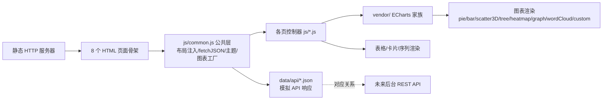

## 产品概述

Cella LAB（微生物实验室）是一个面向合成菌群设计的生物数据库前端模板，收录四类核心数据：合成菌群（来自已发表文献与行业产品的特定功能菌群）、宏基因组测序结果（MAGs、基因注释、环境采样信息）、泛基因组分析结果、代谢通路。数据库定位是为使用者提供合成菌群的设计理论支撑。模板以静态页面 + JSON 示例数据文件形式交付，JSON 即后台接口的响应示例，可在本地静态服务器中直接查看渲染效果，便于后续照此实现后台 API。

## 核心功能

- **网站首页**：数据库介绍、四大数据模块导航卡片、收录统计数字、数据概览图表（菌群功能分类、样本环境分布）、最新收录列表与快捷搜索入口
- **数据库搜索页**：居中大搜索框，附带热点搜索下拉框（含热词排名与热度），支持跳转搜索
- **搜索结果页**：聚合展示合成菌群、物种分类、基因、环境样本、酶、代谢通路六类搜索结果，类别 Tab 筛选，结果卡片跳转对应详情页
- **合成菌群页**：基本信息与菌株列表表格；微生物群落组成饼图/柱状图（可切换）；菌株代谢能力三维 UMAP 散点图（按功能着色）；菌株交叉喂养网络图，以不同颜色与线型区分拮抗、营养互补、营养竞争、跨菌株生物合成通路四类关系；菌群功能描述
- **宏基因组样本页**：样本环境信息卡、群落组成饼图/柱状图、MAGs 层次聚类树、注释基因列表表格、注释基因相关通路列表、基因主题关键词词云
- **泛基因组页**：基因家族分类比例饼图/条形图（核心、软核心、壳、云基因）、泛基因组曲线（累积曲线与核心曲线）、PAV 矩阵热图、SV 结构变异表格与类型分布、共线性分析可视化、基因家族明细表
- **通路数据页**：通路名称/描述/编号、基因列表、代谢物列表、代谢反应列表、代谢网络图可视化、上下游通路链接、关联菌群/合成菌群/宏基因组样本列表
- **基因数据页**：基因名与所属基因家族、关联菌株/宏基因组样本/合成菌群、代表性基因序列（FASTA 展示）、蛋白质结构组成（PFAM 结构域架构图）、所处通路列表

## 视觉效果

整体为学术风浅色主题：平面化、无渐变、细边框白卡片、纸质报告质感，观感贴近 NCBI 网站；深色页头导航 + 纸灰背景 + 衬线标题，图表配色为柔和实色学术色板，四类菌株关系用红/绿/橙/蓝虚线明确区分。

## 技术栈

- **页面**：原生 HTML5 + ES6 JavaScript + CSS3，无框架、无构建步骤，直接静态服务器运行
- **图表**：ECharts 5.5.x（全部图表基础）+ echarts-gl 2.0.9（三维 UMAP 散点 scatter3D）+ echarts-wordcloud 2.1.0（词云），三者均本地化至 `vendor/`，运行时零外网依赖
- **数据**：`data/api/` 下 JSON 文件模拟后台 REST API 响应，页面统一通过 `fetch()` 加载渲染
- **库获取方式**：从 jsdelivr 下载（失败时依序换 unpkg / cdnjs / npmmirror 重试）

## 实现方案

多页静态架构：每页一个 HTML，按顺序引入 `echarts.min.js` → `echarts-gl.min.js`（仅合成菌群页）/ `echarts-wordcloud.min.js`（仅宏基因组页）→ `js/common.js` → 本页 JS。所有页面内容数据驱动，HTML 仅承载骨架，由 JS 注入，保证 JSON 与未来后台 API 一一对应。

**关键决策**：

1. **统一响应信封** `{"code":0,"message":"success","data":{...}}`，`fetchJSON` 统一解包与错误处理，后台只需按同构 JSON 返回即可无缝替换
2. **公共层 common.js**：页头/页脚 DOM 注入与导航高亮、`fetchJSON`、URL 参数解析（`?id=`/`?q=`/`?category=`）、注册统一 ECharts 主题 `cella-paper`、图表工厂（统一 resize 管理）、学术风格表格渲染器
3. **详情页参数化**：`consortium.html?id=COD001` 定位记录，参数缺失回退首个示例，JSON 加载失败显示错误占位卡片而非空白页
4. **各页图表映射**：

- 首页：pie（功能分类）+ bar（环境分布）
- 合成菌群页：pie/bar 可切换（组成）+ `scatter3D`（UMAP 三维嵌入，symbolSize 按丰度、颜色按代谢功能类别）+ `graph` force 布局（交叉喂养网络：拮抗红实线、营养互补绿实线、营养竞争橙实线、跨菌株生物合成蓝虚线；节点大小按相对丰度）
- 宏基因组页：pie/bar（组成）+ `tree`（MAGs 层次聚类，横向）+ 表格（基因、通路）+ `wordCloud`（基因关键词，词频映射字号）
- 泛基因组页：pie/bar（四类基因家族比例）+ 双 Y 轴 line（pan 累积曲线 + core 衰减曲线 + Heap's law 拟合虚线）+ `heatmap` + `visualMap`（PAV 矩阵，Y 轴基因家族、X 轴基因组）+ bar（SV 类型分布）+ `custom series`（共线性：双轨道基因块 + 同源连接线）
- 通路页：`graph`（代谢网络：代谢物节点 + 反应边，上下游通路以独立节点簇表达）
- 基因页：`custom series`（PFAM 结构域水平条带，按 Pfam 家族着色）+ FASTA 等宽字体渲染（碱基着色、60bp 折行）

**性能与可靠性**：

- 图表实例统一注册到 `CellaApp`，window resize 防抖（150ms）后批量 `chart.resize()`，避免重复绑定
- 每个数据区块均有 loading 态与错误占位；fetch 失败不影响其他区块渲染
- echarts-gl / wordcloud 仅在需要页面加载，减小其余页面开销；表格用模板字符串一次性渲染（示例数据量为数十行级别，无性能瓶颈）
- 所有资源相对路径引用，任意静态服务器根目录均可直接运行

## 架构设计



分层：数据层（JSON 模拟 = 未来 API）→ 公共工具层（common.js）→ 页面控制器层（每页一个 js）→ 视图层（HTML + ECharts 实例）。

## 目录结构

```
d:/cella_lab/template/
├── index.html                      # [NEW] 首页骨架：hero+快捷搜索、模块卡片、概览图表容器、最新收录容器
├── search.html                     # [NEW] 搜索页骨架：大搜索框、热词下拉容器、类别说明
├── search-results.html             # [NEW] 结果页骨架：搜索摘要条、类别 Tab、结果列表容器、分页
├── consortium.html                 # [NEW] 合成菌群页骨架：信息卡、组成图、3D UMAP、网络图、菌株表、功能描述
├── metagenome.html                 # [NEW] 宏基因组页骨架：样本信息、组成图、聚类树、基因表、通路表、词云
├── pangenome.html                  # [NEW] 泛基因组页骨架：分类比例图、曲线、PAV 热图、SV、共线性、家族表
├── pathway.html                    # [NEW] 通路页骨架：信息、网络图、上下游、基因/代谢物/反应表、关联列表
├── gene.html                       # [NEW] 基因页骨架：信息、FASTA、PFAM 图、关联列表、通路列表
├── assets/
│   ├── logo.svg                    # [NEW] Cella LAB 学术风线条 logo
│   └── favicon.svg                 # [NEW] 网站图标
├── styles/
│   └── main.css                    # [NEW] 全局唯一样式文件：NCBI 风格设计系统（栅格、页头页脚、卡片、表格、按钮、Tab、表单、响应式）
├── js/
│   ├── common.js                   # [NEW] 公共层 CellaApp：initLayout、fetchJSON、getQueryParam、makeChart、renderTable、cella-paper 主题注册与 resize 管理
│   ├── home.js                     # [NEW] 首页控制器：加载 stats.json 渲染统计、概览图、最新收录
│   ├── search.js                   # [NEW] 搜索页控制器：加载 search/hot.json 实现热词下拉联想与跳转
│   ├── search-results.js           # [NEW] 结果页控制器：加载 search/query.json，由 ?q=/?category= 驱动 Tab 筛选
│   ├── consortium.js               # [NEW] 合成菌群控制器：组成图切换、scatter3D、交叉喂养 graph 网络
│   ├── metagenome.js               # [NEW] 宏基因组控制器：组成图、tree 聚类树、基因/通路表、wordCloud
│   ├── pangenome.js                # [NEW] 泛基因组控制器：比例图、双轴曲线、heatmap PAV、SV 分布、custom 共线性、家族表
│   ├── pathway.js                  # [NEW] 通路控制器：graph 代谢网络、上下游、三类列表表、关联列表
│   └── gene.js                     # [NEW] 基因控制器：FASTA 着色、custom PFAM 结构图、关联与通路列表
├── vendor/
│   ├── echarts/echarts.min.js      # [NEW] ECharts 5.5.x 本地库
│   ├── echarts-gl/echarts-gl.min.js        # [NEW] echarts-gl 2.0.9
│   └── echarts-wordcloud/echarts-wordcloud.min.js # [NEW] echarts-wordcloud 2.1.0
└── data/api/
    ├── stats.json                  # [NEW] GET /api/stats：收录统计、概览图数据、最新收录（首页）
    ├── search/hot.json             # [NEW] GET /api/search/hot：热门搜索词（排名+热度+类别）
    ├── search/query.json           # [NEW] GET /api/search?q=：六类别聚合结果，含每条目跳转目标
    ├── consortium/COD001.json      # [NEW] GET /api/consortium/{id}：信息、菌株表、组成、UMAP 点集、互作边表、功能描述
    ├── consortium/COD002.json      # [NEW] 合成菌群第二示例（演示 ?id= 切换）
    ├── metagenome/MGS001.json      # [NEW] GET /api/metagenome/{id}：样本信息、组成、聚类树结构、基因表、通路表、词频表
    ├── metagenome/MGS002.json      # [NEW] 宏基因组第二示例
    ├── pangenome/PAN001.json       # [NEW] GET /api/pangenome/{id}：分类统计、曲线点集、PAV 矩阵、SV 列表、共线性块、家族表
    ├── pathway/PW001.json          # [NEW] GET /api/pathway/{id}：通路信息、网络节点/边、上下游、基因/代谢物/反应表、关联列表
    └── gene/GENE001.json           # [NEW] GET /api/gene/{id}：基因信息、FASTA、PFAM 结构域区间、关联列表、通路列表
```

## 关键代码结构

统一 API 响应信封（所有 data/api/*.json 遵循，亦即后台 API 契约）：

```
{
  "code": 0,
  "message": "success",
  "data": {
    "consortium_id": "COD001",
    "name": "Butyrate-producing Consortium B-1",
    "strains": [
      { "strain_id": "ST001", "species": "Faecalibacterium prausnitzii", "phylum": "Firmicutes", "abundance": 0.32, "role": "butyrate producer" }
    ],
    "umap": { "points": [{ "strain_id": "ST001", "coords": [-2.1, 1.3, 0.4], "function": "SCFA synthesis" }] },
    "interactions": [
      { "from": "ST001", "to": "ST002", "type": "cross_feeding", "metabolite": "acetate" }
    ]
  }
}
```

common.js 暴露的公共接口（各页面控制器统一调用）：

```javascript
window.CellaApp = {
  initLayout(activeNav) {},      // 注入公共页头/页脚并高亮当前导航
  fetchJSON(path) {},            // fetch + 信封解包，返回 Promise<data>，失败渲染错误占位
  getQueryParam(name) {},        // 读取 ?id= / ?q= / ?category=，返回 string|null
  makeChart(domId) {},           // echarts.init(dom, 'cella-paper') 并注册到统一 resize 管理
  renderTable(domId, columns, rows) {} // 渲染学术风格表格（表头、斑马纹、hover）
};
```

## 实施注意

- 文件统一 UTF-8 编码（`<meta charset="UTF-8">`），UI 中文、科学数据字段（学名、基因名、Pfam、通路编号）英文
- 示例数据需真实可信：使用真实菌属名、丁酸/色氨酸代谢等真实通路、PFAM 真实家族编号，提升模板参考价值
- 所有改动限定在 `d:/cella_lab/template/` 内，不触碰父目录其他项目内容
- 词云与三维扩展必须在 echarts 之后加载；容器需有固定高度否则图表不渲染
- 热图色阶属于数据映射（单色深浅），符合“无装饰性渐变”约束

## 设计风格

模仿 NCBI 网站的学术风格：浅色 light 主题、平面化、无渐变、无重阴影，以细边框白卡片与纸感浅灰背景营造“纸质科研报告”质感。标题用衬线字体（Georgia/思源宋体），正文用无衬线系统字体，图表配色为柔和实色学术色板。

## 统一页面骨架（全站复用）

- **顶部导航栏**：深海军蓝 #14375f 底、白字，左侧 logo + "Cella LAB"，右侧导航（首页/搜索/合成菌群/宏基因组/泛基因组/通路/基因）与迷你搜索框，当前页白色下划线高亮
- **面包屑条**：浅灰底细线，层级路径可点击
- **内容区**：最大宽 1200px 居中，纸灰背景 #f5f5f2，白色卡片 1px #d8d8d2 边框 + 极轻阴影，圆角 2px
- **页脚**：浅色多列（关于/数据模块/帮助/引用格式），底部版权行

## 页面原型设计（8 页归为 4 类原型）

1. **首页**：Hero 区（衬线大标题、数据库一句话简介、快捷搜索框、四格统计数字条）→ 四大数据模块导航卡片（各含图标、名称、简述、收录量）→ 数据概览图表行（功能分类饼图 + 样本环境分布柱状图）→ 最新收录列表（表格）→ 快速入口链接区
2. **搜索体系（搜索页+结果页）**：居中超大搜索框与热搜词标签，输入时下拉热词联想（排名序号+热词+热度条）→ 结果页：搜索摘要条（关键词+总数）+ 类别 Tab（全部/合成菌群/物种分类/基因/环境样本/酶/代谢通路，含各类计数徽标）+ 结果卡片列表（类别徽标、标题、摘要、来源、跳转按钮）+ 分页器
3. **详情页模板（合成菌群/宏基因组/泛基因组/通路/基因共用骨架）**：顶部信息摘要卡（名称、编号、分类标签、来源文献、操作按钮）→ 图表卡片网格（每卡：标题栏+副说明+固定高图表）→ 数据明细表格卡片（斑马纹、表头浅蓝灰）→ 底部关联跳转卡片（互链其他详情页的标签列表）
4. **特色视觉规则**：交叉喂养网络四类关系固定配色（拮抗红/营养互补绿/营养竞争橙/跨菌株生物合成蓝虚线）+ 图例；泛基因组四类基因家族固定色（核心深蓝/软核心青/壳黄/云灰）；PAV 热图单色深浅数据映射；FASTA 序列等宽字体碱基着色；PFAM 结构域水平条带图带家族标签

## 交互

类别 Tab 切换、饼图/柱状图切换按钮、图表 hover tooltip、表格行 hover 高亮、卡片 hover 阴影极轻加深（保持平面感）、面包屑与关联标签跨页跳转（?id= 参数）。

## Agent Extensions

### Skill

- **agent-browser**
- Purpose: 在模板目录启动静态 HTTP 服务器后，用浏览器自动化依次打开全部 8 个页面并截图，验证布局、图表（饼图/柱状图/三维散点/网络图/热图/聚类树/词云/共线性图）、表格与跳转链接的渲染正确性
- Expected outcome: 获得全部页面的渲染截图，确认无空白图表、无控制台级渲染错误、样式符合 NCBI 风格，发现的问题在最终交付前修复