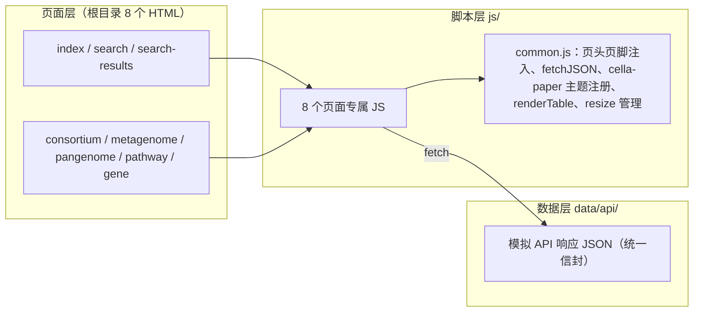

## 用户需求

开发合成菌群数据库 Cella LAB（微生物实验室）的前端模板，存储并展示四类数据：合成菌群（文献/行业产品中的功能性菌群）、宏基因组测序结果（MAGs、基因注释、环境信息）、泛基因组分析结果、代谢通路。数据库定位：为使用者提供合成菌群的设计理论支撑。

## 产品概述

一套纯静态前端模板（HTML + JavaScript + JSON），页面渲染数据全部由 JSON 示例文件提供（模拟后台 API 响应，便于后续照此实现后台 API），可直接启动简单 HTTP 静态文件服务器查看渲染结果。

## 核心功能

- **网站首页**：数据库介绍、快捷搜索、数据统计数字、四大数据模块入口、概览图表、最新收录列表
- **数据库搜索页**：关键词搜索框 + 热点搜索下拉框（热词排名与热度展示）
- **搜索结果页**：聚合合成菌群、物种分类、基因、环境样本、酶、代谢通路等类别结果，支持按类别 Tab 筛选，结果卡片可跳转详情页
- **合成菌群展示页**：饼图/柱状图展示微生物群落组成；三维散点图展示菌株代谢能力 3D UMAP 嵌入；网络图展示交叉喂养关系（拮抗、营养互补、营养竞争、跨菌株生物合成通路）；菌群功能描述
- **宏基因组样本展示页**：饼图/柱状图展示群落组成；层次聚类树展示 MAGs 聚类；注释基因列表；基因相关通路列表；词云展示基因主题关键词；样本信息
- **泛基因组分析页**：饼图/条形图展示基因家族分类比例（核心、软核心、壳、云基因）；泛基因组曲线；热图展示 PAV 矩阵；SV 结构变异；共线性分析结果；基因家族详细结果
- **通路数据页**：通路名称与描述、基因列表、代谢物列表、代谢反应列表、网络图可视化、上下游通路、关联菌群/合成菌群/宏基因组样本
- **基因数据页**：基因名、所属基因家族、关联菌株/宏基因组样本/合成菌群、代表性基因序列、PFAM 结构域信息、所处通路

## 视觉与交付

- 样式模仿 NCBI：突出学术风格、light 主题、平面化、避免渐变色、纸质报告质感
- 脚本入 js/、样式入 styles/、第三方库入 vendor/、SVG 资源入 assets/
- 所有图表基于 ECharts 实现

## 技术栈

- **页面结构**：HTML5（8 个页面文件置于模板根目录 d:/cella_lab/template/）
- **脚本**：原生 JavaScript（ES6+，IIFE 作用域，无框架、无构建工具）
- **样式**：原生 CSS（styles/main.css 单文件，CSS 变量定义主题色板）
- **可视化**：ECharts 5.5.x + echarts-gl 2.0.9（3D UMAP scatter3D）+ echarts-wordcloud 2.1.0（词云），全部下载至 vendor/ 本地引用（jsdelivr 主源，unpkg/cdnjs/npmmirror 备用）
- **数据**：data/api/ 下 JSON 文件模拟后台 API 响应，统一信封 `{"code":0,"message":"success","data":{...}}`

## 实现方案

- **数据视图分离**：HTML 仅声明容器骨架；common.js 注入统一页头/页脚并提供公共工具；每个页面专属 JS 通过 fetch 加载 JSON 后渲染信息卡、表格与图表
- **JSON 即 API 蓝本**：文件路径模拟 REST 路径（如 data/api/search/query.json 对应 GET /api/search/query），字段驼峰命名、自解释，列表包含 total/page/pageSize 分页字段，方便用户对齐后台实现
- **详情页参数化**：通过 URL 参数（如 consortium.html?id=COD001）加载对应 JSON，未传参默认加载首个示例；fetch 失败时渲染错误占位块
- **关键决策**：
- 无框架无构建：用户明确要求纯 html+js+json 静态模板，静态服务器直接可看，引入构建链反而增加负担
- vendor 本地化：版本锁定、离线可用，避免运行时依赖 CDN
- common.js 注入页头页脚：8 个页面共享导航与搜索框，避免重复维护（DRY），当前页导航高亮

## 架构设计

三层静态架构：页面层（HTML）→ 脚本层（公共工具 + 页面逻辑）→ 数据层（模拟 API JSON）



**JSON 数据结构要点**（字段自解释，供后台 API 参照）：

- `search/query.json`：关键词 + 7 类别结果数组（每条含 id、title、description、category、url、元信息）
- `consortium/COD001.json`：基本信息（名称、来源文献 DOI、功能分类、描述）、菌株列表（株名/物种/丰度/角色）、umap3d 点集（xyz + 功能类别）、网络图（节点=菌株，边=四种关系类型）、功能描述段落
- `metagenome/MGS001.json`：样本信息（环境/地点/测序平台/文献）、群落组成、MAGs 层次聚类树（children 嵌套结构）、注释基因列表、通路列表、词云词频
- `pangenome/PAN001.json`：概要、四分类统计、泛基因组曲线数据点（含 Heap's law 拟合参数）、PAV 矩阵（基因家族×菌株 0/1）、SV 列表与类型统计、共线性区块（双轨道坐标+连接）、基因家族表
- `pathway/PW001.json`：通路信息、网络（节点=代谢物/酶，边=反应）、上下游通路、基因/代谢物/反应表、关联列表
- `gene/GENE001.json`：基因信息、家族、关联实体、FASTA 序列、PFAM 域（名称/起止坐标）、所处通路

## 目录结构

```
d:/cella_lab/template/
├── index.html                 # [NEW] 首页：hero 简介与快捷搜索、统计数字、四模块卡片、概览图表、最新收录
├── search.html                # [NEW] 搜索页：大搜索框、热搜下拉联想、分类搜索指引
├── search-results.html        # [NEW] 搜索结果页：类别 Tab 筛选、分组结果卡片、分页与空态
├── consortium.html            # [NEW] 合成菌群详情页：信息与菌株表、组成图、3D UMAP、交叉喂养网络、功能描述
├── metagenome.html            # [NEW] 宏基因组样本页：样本信息、组成图、MAGs 聚类树、基因/通路表、词云
├── pangenome.html             # [NEW] 泛基因组页：分类比例图、曲线、PAV 热图、SV、共线性、基因家族表
├── pathway.html               # [NEW] 通路数据页：通路信息、代谢网络图、上下游、三列表格、关联列表
├── gene.html                  # [NEW] 基因数据页：基因信息、关联实体、FASTA 序列、PFAM 域架构图、通路列表
├── README.md                  # [NEW] 使用说明：静态服务器启动方式、目录结构、JSON API 路径与信封结构对照表
├── assets/
│   ├── logo.svg               # [NEW] Cella LAB logo（衬线体+简约线条，学术风）
│   ├── favicon.svg            # [NEW] 站点图标
│   └── icons.svg              # [NEW] 四大模块 SVG symbol 图标集
├── styles/
│   └── main.css               # [NEW] 全局唯一样式表：主题 CSS 变量、导航、卡片、表格、按钮、Tab、面包屑、图表容器、响应式
├── js/
│   ├── common.js              # [NEW] 公共脚本：header/footer 注入、fetchJSON（含错误处理）、URL 参数解析、ECharts 'cella-paper' 主题注册、renderTable 工具、图表实例统一 resize 管理（节流）
│   ├── home.js                # [NEW] 首页逻辑：统计数字、功能分类饼图、环境分布柱状图、最新收录列表
│   ├── search.js              # [NEW] 搜索页逻辑：热搜下拉（排名+热度条）、回车/点击跳转 search-results.html?q=
│   ├── search-results.js      # [NEW] 结果页逻辑：读取 ?q=、类别 Tab 切换过滤、分组卡片渲染
│   ├── consortium.js          # [NEW] 合成菌群页：饼图/柱状图切换、echarts-gl scatter3D（按功能着色、可旋转）、力导向网络图（四类关系边+图例）
│   ├── metagenome.js          # [NEW] 宏基因组页：组成图、tree 系层次聚类树、基因/通路表格渲染、echarts-wordcloud 词云
│   ├── pangenome.js           # [NEW] 泛基因组页：饼图/条形图切换、双 Y 轴曲线（pan 累积+core 衰减+拟合虚线）、heatmap+visualMap PAV 矩阵、SV 表+分布图、custom series 共线性双轨道、基因家族表
│   ├── pathway.js             # [NEW] 通路页：graph 代谢网络（代谢物节点+反应边）、上下游链接、三列表格、关联列表
│   └── gene.js                # [NEW] 基因页：FASTA 碱基着色展示、custom series PFAM 域水平条带图、关联列表、通路列表
├── vendor/
│   ├── echarts/echarts.min.js                 # [NEW] ECharts 5.5.x
│   ├── echarts-gl/echarts-gl.min.js           # [NEW] echarts-gl 2.0.9（须在 echarts 之后加载）
│   └── echarts-wordcloud/echarts-wordcloud.min.js  # [NEW] echarts-wordcloud 2.1.0
└── data/api/
    ├── stats.json             # [NEW] 首页统计数字
    ├── home/latest.json       # [NEW] 最新收录条目列表
    ├── search/hot.json        # [NEW] 热搜词（排名、热词、热度值）
    ├── search/query.json      # [NEW] 聚合搜索结果（7 类别）
    ├── consortium/COD001.json # [NEW] 合成菌群示例 1（完整字段）
    ├── consortium/COD002.json # [NEW] 合成菌群示例 2
    ├── metagenome/MGS001.json # [NEW] 宏基因组样本示例 1
    ├── metagenome/MGS002.json # [NEW] 宏基因组样本示例 2
    ├── pangenome/PAN001.json  # [NEW] 泛基因组分析结果
    ├── pathway/PW001.json     # [NEW] 通路数据示例
    └── gene/GENE001.json      # [NEW] 基因数据示例
```

## 关键代码结构

common.js 对外接口（示意）：

```javascript
Cella.fetchJSON(path)            // Promise，失败时渲染错误占位并返回 null
Cella.getParam(name)             // URL 查询参数解析
Cella.renderTable(container, columns, rows)  // 语义化表格构建（thead/th）
Cella.initChart(dom)             // 创建 'cella-paper' 主题实例并纳入统一 resize 管理
Cella.injectLayout(activeNav)    // 注入页头页脚并高亮当前导航项
```

## 实施注意事项

- **加载顺序**：echarts.min.js 必须先于 echarts-gl / echarts-wordcloud 加载；仅合成菌群页引入 echarts-gl、仅宏基因组页引入 wordcloud，其余页面不加载以减少体积
- **性能**：页面多模块数据用 Promise.allSettled 并行 fetch，单模块失败不阻塞整页；PAV 热图矩阵控制在约 40 基因家族 × 20 菌株、词云 ≤ 80 词、UMAP 点数 ≤ 60，保证交互流畅；图表容器固定高度避免初始化抖动；resize 节流 200ms
- **运行约束**：file:// 协议下 fetch 受 CORS 限制，README 中说明须以 HTTP 静态服务器启动（python -m http.server 8000 或 npx serve）
- **风格一致性**：全部图表走同一 'cella-paper' 主题（扁平实色、浅灰网格、白底细边框 tooltip），禁止渐变；保持向后兼容示例数据结构，便于用户直接替换为真实 API

## 设计风格

模仿 NCBI 网站的学术风格：light 主题、平面化、无渐变、细边框、类似纸质报告的质感。深海军蓝页头 + 纸感浅灰背景 + 白色内容卡片；标题采用衬线字体强化纸质学术感，正文使用系统无衬线字体；图表使用柔和扁平实色学术色板。

## 共享布局（全部页面）

- **顶部导航**：深海军蓝 #14375f，左侧衬线体 logo "Cella LAB"，中部导航（首页/数据库搜索/合成菌群/宏基因组/泛基因组/通路/基因），右侧站内搜索输入框；当前页导航项白色下划线高亮
- **内容区**：最大宽度 1200px 居中；白色卡片带 1px 边框与极浅阴影；卡片标题左侧 3px 主蓝竖线，衬线体
- **页脚**：浅灰底多列（数据库简介/数据模块/帮助/引用格式），底部版权与数据版本号
- **交互**：链接与按钮 hover 深浅色切换（无渐变无动效堆砌）；表格行 hover 浅蓝灰底；面包屑导航置于详情页顶部

## 页面块设计

**首页**：1) Hero 区：数据库定位一句话、大搜索框、热词快捷标签；2) 数据统计条：合成菌群/菌株/MAGs/基因/通路/样本六项数字横排卡片；3) 四大模块卡：图标+名称+简介+浏览入口；4) 概览图表区：功能分类饼图+环境分布柱状图双卡并排；5) 最新收录列表：最新合成菌群与样本条目含日期链接

**搜索页**：1) 标题说明区：搜索范围说明；2) 搜索框区：居中大输入框+热搜下拉（排名、热词、热度条）；3) 分类指引：七类别搜索示例卡片；4) 热门标签墙：热词点击即搜

**搜索结果页**：1) 顶部搜索条：保留关键词可再搜+结果总数；2) 类别筛选 Tab：全部/合成菌群/物种分类/基因/环境样本/酶/代谢通路；3) 结果列表：按类别分组卡片（标题、描述、元数据、详情链接）；4) 分页条与空结果占位

**合成菌群页**：1) 信息区：名称、来源文献、功能定位、菌株表格；2) 群落组成图：饼图/柱状图切换；3) 3D UMAP：echarts-gl 三维散点按代谢功能着色可旋转；4) 交叉喂养网络：力导向图四类关系边（拮抗红/互补绿/竞争橙/跨菌株合成蓝虚线）+图例；5) 功能描述文字区

**宏基因组页**：1) 样本信息卡：环境类型、地点、测序平台、文献；2) 群落组成图：饼图/柱状图切换；3) MAGs 层次聚类树；4) 注释基因表+通路表；5) 基因关键词词云

**泛基因组页**：1) 分析概要：对象、菌株数、基因家族统计；2) 基因家族分类图：核心/软核心/壳/云饼图+条形图；3) 泛基因组曲线：pan 累积与 core 衰减双曲线；4) PAV 矩阵热图；5) SV 变异表+类型分布图；6) 共线性双轨道图+基因家族详情表

**通路页**：1) 通路信息区：名称、编号、描述、上下游通路链接；2) 代谢网络图：代谢物节点+反应边；3) 基因/代谢物/反应三个表格；4) 关联菌群、合成菌群、宏基因组样本列表

**基因页**：1) 基因信息区：名称、基因家族、功能注释；2) 关联区：菌株/样本/合成菌群；3) FASTA 序列区：等宽字体碱基着色；4) PFAM 结构域架构图：水平条带+图例；5) 所处通路列表

## 响应式

桌面优先设计；窄屏下导航折叠、双列卡片/图表纵向堆叠、表格横向滚动。

## Agent Extensions

### Skill

- **agent-browser**
- Purpose: 在本地启动静态 HTTP 服务器后，用浏览器逐页打开 8 个页面并截图，验证 ECharts 图表渲染、布局与交互（Tab 筛选、3D 旋转、下拉联想）是否正常
- Expected outcome: 获得全部页面截图，定位并修复空白图表、布局错位、JSON 加载失败等问题，确保静态服务器下所有页面可正常浏览