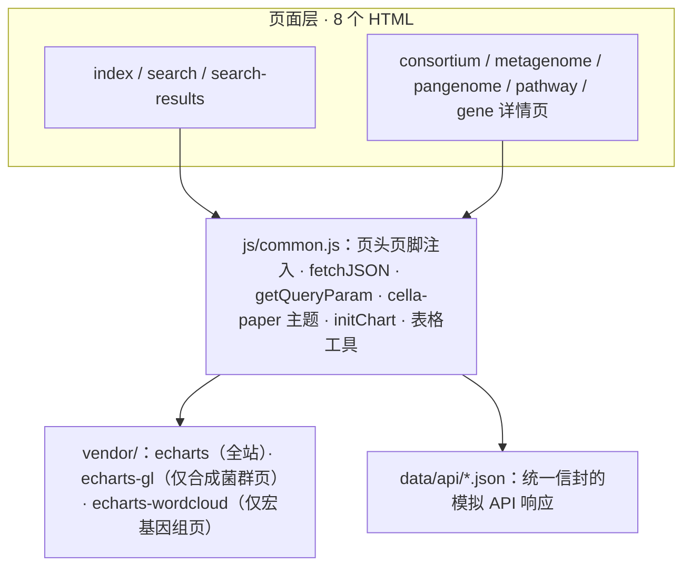

## 产品概述

Cella LAB（微生物实验室）是一个合成菌群数据库的前端站点模板，聚合四类核心数据：合成菌群、宏基因组测序结果（MAGs/基因注释/环境信息）、泛基因组分析结果、代谢通路，为使用者提供合成菌群设计的理论支撑。站点整体为浅色、扁平、纸质报告质感的学术风格，共 8 个页面；示例数据以 JSON 文件模拟后台接口响应，通过本地静态服务器即可直接查看渲染结果。

## 核心功能

- **网站首页**：数据库简介与快捷搜索框、收录统计数字条、四大数据模块导航卡片、数据概览图表（合成菌群功能分类占比、样本环境分布）、最新收录列表
- **数据库搜索页**：居中大搜索框，聚焦时展示热点搜索下拉榜单（含排名与热度），各数据类别检索说明与入口
- **搜索结果页**：聚合展示合成菌群、物种分类、基因、环境样本、酶、代谢通路等多类别结果；类别 Tab 筛选并显示各类计数；结果卡片可跳转对应详情页；回显并高亮搜索词
- **合成菌群详情页**：基本信息卡与菌株列表表；饼图/柱状图可切换展示微生物群落组成；三维散点图展示菌株代谢能力的 UMAP 嵌入（可旋转、按功能着色）；网络图展示菌株交叉喂养关系（拮抗/营养互补/营养竞争/跨菌株生物合成通路四类边，可按类型筛选）；菌群功能描述
- **宏基因组样本详情页**：样本信息卡（环境类型、采样地点、测序平台等）；群落组成饼图/柱状图；MAGs 层次聚类树；注释基因列表表格；关联通路列表表格；基因主题关键词词云
- **泛基因组分析页**：基因家族分类比例饼图/条形图（核心/软核心/壳/云基因）；泛基因组曲线（累积曲线与核心基因衰减曲线）；PAV 矩阵热图（二值着色）；结构变异类型分布与明细；共线性分析可视化（双基因组轨道与同线性区块连线）；基因家族详细结果表
- **通路数据页**：通路名称/描述/编号；基因、代谢物、代谢反应列表；代谢网络图（代谢物与反应节点连线可视化）；上游/下游通路链接；关联菌群、合成菌群与宏基因组样本列表
- **基因数据页**：基因名与所属基因家族；关联菌株、宏基因组样本、合成菌群；代表性基因序列（FASTA 展示、碱基着色）；PFAM 蛋白结构域架构条带图；所处通路列表
- **页面互链**：各详情页通过关联 ID 相互跳转，形成数据库网状导航

## 技术栈

- 纯静态前端：原生 HTML5 + JavaScript (ES6) + CSS，无构建步骤、无前端框架
- 图表：ECharts 5.5.x（本地化至 vendor/），扩展 echarts-gl 2.0.9（3D UMAP 散点）、echarts-wordcloud 2.1.0（词云），满足"所有图表基于 ECharts"的要求
- 数据：data/api/ 下 JSON 文件模拟后台 REST API 响应，页面统一通过 fetch 加载
- 运行：任意静态 HTTP 服务器（python -m http.server / npx serve）直接查看

## 实现方案

- **架构策略**：每页一个 HTML + 一个专属 JS；公共逻辑（页头/页脚注入、fetch 封装、URL 参数解析、ECharts 主题注册与实例管理、表格渲染工具）集中在 js/common.js；所有图表共用注册的 'cella-paper' 自定义主题保证视觉一致
- **API 契约设计**：统一响应信封 `{code, message, data}`；fetch URL 带真实查询参数（如 `data/api/search/query.json?q=xxx`、`data/api/consortium/COD001.json`），静态服务器忽略查询串仍能取到文件，同时天然成为后台 API 路径文档，方便用户照此实现后台
- **关键决策**：
- 第三方库全部本地化到 vendor/（jsdelivr 下载，失败备选 unpkg/cdnjs/npmmirror），离线可用；echarts-gl 与 wordcloud 仅在对应页面引入，避免其它页面加载开销
- 详情页支持 `?id=` 参数，缺省加载首个示例；未知 id 请求 404 时展示错误占位而非空白页
- 长列表（基因、基因家族）采用前端分页或"前 N 条 + 展开更多"，避免一次性渲染上千行 DOM
- **性能**：所有图表实例集中登记，单一 debounce 的 window resize 监听批量 resize，页面卸载时 dispose；JSON 示例规模控制在演示级（PAV 矩阵约 20 家族 × 12 基因组）

## 系统架构



**页面与数据/图表映射（要点）**

- 首页：stats.json → 统计条、功能分类饼图、环境分布柱状图、最新收录列表
- 搜索页：hot.json → 热词下拉（排名 + 热度），提交跳转 search-results.html?q=
- 结果页：query.json → 类别 Tab（全部/合成菌群/物种分类/基因/环境样本/酶/代谢通路）计数与卡片，卡片按类别链接到对应详情页 ?id=
- 合成菌群页：composition（饼/柱切换）、umap3d（scatter3D，symbolSize 按丰度、色按代谢功能）、interaction 网络（graph 力导向，四类边：拮抗红实线/营养互补绿实线/营养竞争橙实线/跨菌株合成蓝虚线，legend 筛选）
- 宏基因组页：composition、magsTree（tree 系列层次聚类树）、genes/pathways 表格、keywords（wordCloud）
- 泛基因组页：familyPie（核心/软核心/壳/云）、panCurve（双 Y 轴折线 + Heap's law 拟合虚线）、pavHeatmap（heatmap + visualMap 二值）、sv（类型条形图 + 明细表）、collinearity（custom series 双轨道基因块 + 同线性连线）、families 表
- 通路页：network（graph：代谢物圆点 + 反应/酶方块 + 方向边）、上下游通路卡片、基因/代谢物/反应三张表、关联菌群/合成菌群/样本列表
- 基因页：FASTA 碱基着色（等宽字体、每 60 碱基换行）、PFAM 架构（custom series 水平条带）、关联列表、所处通路

## 目录结构

```
d:/cella_lab/template/
├── index.html                     # [NEW] 网站首页：Hero+快捷搜索、统计条、四大数据模块卡片、概览双图、最新收录
├── search.html                    # [NEW] 搜索页：大搜索框、热点搜索下拉、分类检索说明
├── search-results.html            # [NEW] 搜索结果页：类别 Tab 筛选、结果卡片、关键词回显高亮
├── consortium.html                # [NEW] 合成菌群详情页：信息卡、菌株表、组成图、3D UMAP、交叉喂养网络、功能描述
├── metagenome.html                # [NEW] 宏基因组样本页：样本信息、组成图、MAGs 聚类树、基因/通路表、词云
├── pangenome.html                 # [NEW] 泛基因组页：家族比例图、泛基因组曲线、PAV 热图、SV、共线性、家族表
├── pathway.html                   # [NEW] 通路数据页：通路信息、代谢网络图、三张列表、上下游与关联列表
├── gene.html                      # [NEW] 基因数据页：基因信息、FASTA 序列、PFAM 架构图、关联列表、通路
├── README.md                      # [NEW] 使用说明：如何启动静态服务器、JSON 数据结构说明、vendor 库版本
├── assets/
│   ├── logo.svg                   # [NEW] Cella LAB 站点 logo（衬线文字 + 简约培养皿/菌落图形）
│   └── favicon.svg                # [NEW] 站点图标
├── styles/
│   └── main.css                   # [NEW] 全局唯一样式：NCBI 纸质风格、页头页脚、卡片、表格、Tab、面包屑、响应式
├── js/
│   ├── common.js                  # [NEW] 公共层：页头/页脚注入、fetchJSON、getQueryParam、面包屑、cella-paper 主题注册、initChart、renderDataTable
│   ├── home.js                    # [NEW] 首页：加载 stats.json，渲染统计与两张概览图
│   ├── search.js                  # [NEW] 搜索页：hot.json 热词下拉、提交跳转
│   ├── search-results.js          # [NEW] 结果页：读 ?q=，加载 query.json，Tab 筛选与卡片渲染
│   ├── consortium.js              # [NEW] 合成菌群页：组成饼/柱切换、scatter3D UMAP、graph 交叉喂养网络
│   ├── metagenome.js              # [NEW] 宏基因组页：组成图、tree 聚类树、表格、wordCloud
│   ├── pangenome.js               # [NEW] 泛基因组页：饼/条形、双轴折线、heatmap PAV、custom 共线性、表格
│   ├── pathway.js                 # [NEW] 通路页：graph 代谢网络、上下游与关联列表渲染
│   └── gene.js                    # [NEW] 基因页：FASTA 着色渲染、custom PFAM 架构、关联列表
├── vendor/
│   ├── echarts/echarts.min.js              # [NEW] ECharts 5.5.1（jsdelivr 下载本地化）
│   ├── echarts-gl/echarts-gl.min.js        # [NEW] echarts-gl 2.0.9（仅 consortium.html 引入）
│   └── echarts-wordcloud/echarts-wordcloud.min.js  # [NEW] echarts-wordcloud 2.1.0（仅 metagenome.html 引入）
└── data/api/
    ├── stats.json                 # [NEW] GET /api/stats：首页统计、概览图数据、最新收录
    ├── search/
    │   ├── hot.json               # [NEW] GET /api/search/hot：热搜词（词、类别、热度、排名）
    │   └── query.json             # [NEW] GET /api/search?q=：聚合各类别结果（每类计数 + 条目 + 跳转 id）
    ├── consortium/
    │   ├── COD001.json            # [NEW] GET /api/consortium/{id}：信息、菌株、组成、UMAP 坐标、网络边、功能描述
    │   └── COD002.json            # [NEW] 第二个示例菌群，验证 ?id= 切换
    ├── metagenome/
    │   ├── MGS001.json            # [NEW] GET /api/metagenome/{id}：样本信息、组成、MAGs 树、基因、通路、词云
    │   └── MGS002.json            # [NEW] 第二个环境样本示例（不同环境类型）
    ├── pangenome/
    │   └── PAN001.json            # [NEW] GET /api/pangenome/{id}：家族分类、曲线点、PAV 矩阵、SV、共线性块、家族表
    ├── pathway/
    │   └── PW001.json             # [NEW] GET /api/pathway/{id}：通路信息、网络节点边、列表、上下游、关联
    └── gene/
        └── GENE001.json           # [NEW] GET /api/gene/{id}：基因信息、序列、PFAM 域、关联、通路
```

## 实施注意事项

- **视觉一致性**：所有 ECharts 实例经 initChart() 使用统一 'cella-paper' 主题（扁平学术色板 #20558a/#3a8f5f/#c1873b/#8f3a3a/#5f5f8f/#3a7f8f/#7a6a3a/#6b8f3a，细轴线，无渐变无阴影）
- **错误处理**：fetchJSON 对网络失败/404/code!==0 统一在目标内容区渲染错误占位（显示请求 URL）；检测到 file:// 协议时提示需通过 HTTP 服务器访问
- **脚本加载顺序**：echarts 必须先于 echarts-gl / echarts-wordcloud 加载，script 标签按序引入
- **静态兼容**：fetch URL 带查询参数模拟真实 API，静态服务器忽略查询串返回同一 JSON；内部链接统一小写，迁移 Linux 服务器不 404
- **示例数据科学合理性**：使用真实物种名（如 Bifidobacterium longum、Faecalibacterium prausnitzii）、贴合合成菌群场景的基因/通路（如丁酸合成通路、PFAM 真实条目），提升模板可信度
- **vendor 下载**：PowerShell Invoke-WebRequest 从 jsdelivr 下载，失败依次换 unpkg/cdnjs/npmmirror 重试
- **爆炸半径**：全新模板自 4 个空目录起步，仅产出 d:/cella_lab/template 内文件，不触碰父目录其它项目

## 关键代码结构

```
// data/api/*.json 统一响应信封（后台 API 契约，所有接口一致）
{
  "code": 0,
  "message": "success",
  "data": { "id": "COD001", "...": "实体字段（自解释命名，含图表所需的结构化数据）" }
}
```

```javascript
// js/common.js 关键接口（各页面依赖的核心契约）
fetchJSON(url)                              // Promise：解析信封，code!==0 或网络失败时抛错
getQueryParam(name)                         // 读取 URL 查询参数（?id= / ?q=）
renderHeader(activeNavKey); renderFooter()  // 统一注入页头页脚并高亮当前导航
initChart(el, option)                       // 以 'cella-paper' 主题创建实例并登记，统一 resize/dispose
renderDataTable(el, columns, rows, opts)    // 通用表格渲染（支持分页 / 前 N 条展开）
```

## 设计风格

模仿 NCBI 网站的学术风格：浅色主题、扁平化、无渐变、纸质报告质感。

- **整体布局**：深海军蓝页头（logo + 主导航 + 搜索框）、详情页面包屑条、1200px 居中内容区、浅灰多列页脚；内容以白底卡片承载，1px #d8d8d2 细边框 + 极细微阴影（0 1px 2px rgba(0,0,0,.06)）
- **字体**：品牌名与页面大标题用衬线字体（Georgia / 宋体系）增强纸质感；正文、表格、按钮用系统 sans-serif（Segoe UI / Microsoft YaHei）
- **组件质感**：表格浅蓝灰表头 #eef3f8、细横线分隔；按钮扁平带边框无渐变；圆角 2-3px；图表统一扁平学术色板，细轴线，无阴影无渐变
- **首页分块**：Hero（衬线大标题 + 简介 + 快捷搜索框）→ 收录统计数字条 → 四大数据模块卡片（图标 + 名称 + 简介 + 入口链接）→ 概览图表区（左右双图）→ 最新收录列表
- **详情页统一模式**：面包屑 + 标题信息卡 → 图表网格（两列布局，窄屏折为单列）→ 数据列表表格 → 关联条目跳转区
- **交互**：导航与 Tab hover 背景变化、图表 tooltip、图例点击筛选关系类型、卡片 hover 阴影微升；无夸张动画，仅细微过渡
- **响应式**：容器 max-width 1200px，栅格在窄屏折为单列，基础媒体查询覆盖

## Agent Extensions

### Skill

- **agent-browser**
- Purpose: 全部页面开发完成后，启动本地静态 HTTP 服务器，逐页打开 8 个 HTML 页面截图，验证图表渲染、布局、导航跳转与资源加载是否正常
- Expected outcome: 每页获得截图并确认无空白图表、无 404 资源、无布局错乱；发现的问题（如 3D 图不渲染、词云为空、JSON 路径错误）得到定位与修复