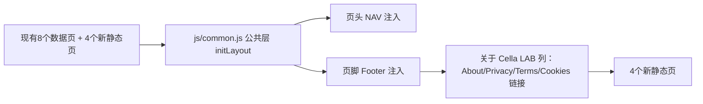

## 用户需求概述

在当前 Cella LAB 合成菌群数据库前端模板（8 个页面）的基础上，新增 4 个纯静态内容页面：Privacy Policy（隐私政策）、Terms of Service（服务条款）、Cookie Policy（Cookie 政策）、About（关于），并将这 4 个页面链接到现有模板页面中，保持与现有 NCBI 学术风格（纸质报告质感、扁平、light 主题、细边框白卡片、衬线标题）完全一致的视觉样式。

## 核心功能

- **About 页面**：介绍 Cella LAB 数据库的定位、数据来源（合成菌群、宏基因组、泛基因组、代谢通路四类）、使用场景（为合成菌群设计提供理论支撑）、版本与联系方式（演示用途占位）。
- **Privacy Policy 页面**：说明数据收集范围、使用目的、信息存储与保护、第三方服务、用户权利、政策更新日期（演示占位，非法律意见）。
- **Terms of Service 页面**：说明服务用途、使用规范、知识产权、免责声明、责任限制、条款变更（演示占位）。
- **Cookie Policy 页面**：说明 Cookie 用途分类（必要/分析/偏好）、管理方式、与隐私政策的关系。
- **模板链接接入**：在现有全站页脚“关于 Cella LAB”列中增加这 4 个页面的入口链接，使所有模板页均可跳转访问。

## 视觉与交互效果

延续现有 NCBI 风格：深海军蓝页头 + 纸灰背景 + 衬线标题 + 扁平白卡片；新页面使用 760px 窄版内容容器（复用现有 `.page-narrow` 样式），章节用 `<h2>/<h3>` 与分隔线组织，面包屑（首页 / 页面名）保持导航一致性与可返回性。

## 技术栈

- 纯原生 HTML5 + 极简内联 JavaScript，复用现有 `js/common.js` 公共层与 `styles/main.css`，无构建步骤、无新增第三方库、无新增 CSS 文件。
- 页面通过 `<script>window.CellaApp.initLayout("about"|"privacy"|"terms"|"cookies")</script>` 复用现有页头/页脚注入机制，无需独立 JS 控制器文件（区别于现有 8 个数据驱动页）。

## 实现方案

1. **复用现有公共层**：4 个新页面均引入 `js/common.js`，调用 `CellaApp.initLayout(key)` 自动注入页头导航与页脚，保证与现有模板 DOM 结构、主题、响应式完全一致。
2. **页脚链接接入**：修改 `js/common.js` 的 `buildFooter()`，在“关于 Cella LAB”列 `<ul>` 中追加 4 个 `<a>`（about.html / privacy.html / terms.html / cookies.html），使全站页脚统一出现入口，满足“链接到当前模板页面”的要求，且不挤占顶部 NAV（避免导航栏过度拥挤，符合学术站惯例）。
3. **内容组织**：每页使用 `<main class="page-narrow">` 容器，顶部面包屑（首页 / 页面名），正文以卡片化段落或纯章节标题 + 分隔线呈现；文案为中文、面向合成菌群数据库场景的通用演示模板，含“最后更新 / 版本”占位，并明确标注“演示用途，非法律意见”。
4. **可访问性/健壮性**：所有内部链接采用相对路径；无需 fetch、无外部网络依赖；与现有静态服务器直接打开方式兼容。

## 实现注意事项

- 不修改 `NAV` 主菜单数组（保持顶部导航精简），仅在页脚扩展链接。
- 新页面 `initLayout` 的 key 仅为高亮标识，不与现有 7 个主菜单冲突（页脚链接无需高亮当前项，可与现有 NAV 高亮逻辑共存）。
- 复用现有 `.breadcrumb`、`.card`、`.page-narrow`、`.section-title` 等样式，不新增 CSS 类，确保零回归。
- 所有文件 UTF-8、UI 中文、演示占位信息清晰。

## 架构设计

整体沿用现有“公共层注入 + 页面静态骨架”架构，4 个新页为纯静态内容页，不引入数据层或图表层，与现有 8 页完全解耦、可独立维护。



## 目录结构

```
d:/cella_lab/template/
├── about.html      # [NEW] About 关于页面：数据库定位、数据来源、使用场景、版本与联系
├── privacy.html    # [NEW] Privacy Policy 隐私政策页面
├── terms.html      # [NEW] Terms of Service 服务条款页面
├── cookies.html    # [NEW] Cookie Policy Cookie 政策页面
└── js/
    └── common.js   # [MODIFY] buildFooter() 的“关于 Cella LAB”列追加 4 个页面链接
```

（其余 HTML/CSS/JS/vendor/data 文件均不改动）

沿用现有 Cella LAB NCBI 学术风格设计系统，不引入新组件库与新样式文件。4 个新页面采用 `.page-narrow`（最大宽 760px 居中）窄版内容布局，顶部深海军蓝页头与底部多列页脚由 common.js 自动注入，保持与现有 8 页完全一致的纸质报告质感外观。页面正文以衬线标题（Georgia/思源宋体）组织章节，白卡片 + 1px 细边框 + 极轻阴影承载段落，面包屑提供“首页 / 页面名”返回路径。